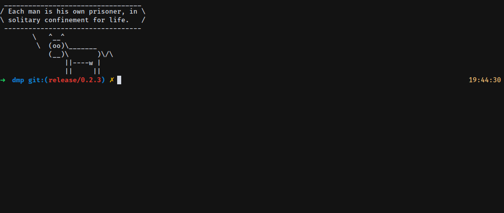

# Dmp
[](https://travis-ci.org/franccesco/dmp) [](https://coveralls.io/github/franccesco/dmp?branch=develop) [](https://badge.fury.io/rb/dmp)

**DMP** (or _Dice My Pass_) is a simple passphrase generator that gives you a passphrase of the desired length using [EFF's long wordlist](http://eff.org/dice). **This little tool was only created for a blog post on how to create a Ruby gem at codingdose.info (WIP) and should be NOT used for production**, can't say much if you like it though.

<p align="center">
  
</p>

## Installation

Add this line to your application's Gemfile:

```ruby
gem 'dmp'
```

And then execute:

    $ bundle

Or install it yourself as:

    $ gem install dmp

## Usage

### You can use it as a library in your code.
```ruby
irb(main):001:0> require 'dmp'
=> true
irb(main):002:0> Dmp.gen_passphrase(4)
=> ["discount", "stove", "rubbing", "underage"]
```

### Or you can use the CLI if you want to execute it in the terminal.

**Generate a passphrase**
```
$ dmp
- Passphrase: bagpipe sprinkled unscented trespass splice outlet headlamp
```

**Generate a passphrase and copy it to the clipboard**
```
- Passphrase: reconvene glimmer treading swerve zebra visibly veal
- Copied to clipboard.
```

**Generate a passphrase of your desired length and check if the password appears in HIBP datasets**
```
$ dmp gen 5 -H
- Passphrase: tavern silly afar luncheon cement
- Password is safe to use.
```

**Warns you if your password has been discovered in a HIBP dataset.**
```
- Passphrase: angular
- WARNING: Passphrase vulnerable 91 times!
```
**Check a password of yours**
```
$ dmp check
Enter your password, press ENTER when you're done.
Password (hidden): ****
- Your password appears in 213580 data sets!
```

**Help**
```
Commands:
  dmp about           # Displays version number and information
  dmp check           # Check if a password/passphrase is vulnerable.
  dmp gen [length]    # Generate a passphrase of the desired length.
  dmp help [COMMAND]  # Describe available commands or one specific command
```

## Contributing

Bug reports and pull requests are welcome on GitHub at https://github.com/franccesco/dmp. This project is intended to be a safe, welcoming space for collaboration, and contributors are expected to adhere to the [Contributor Covenant](http://contributor-covenant.org) code of conduct.

## License

The gem is available as open source under the terms of the [MIT License](https://opensource.org/licenses/MIT).

## Code of Conduct

Everyone interacting in the Dmp project’s codebases, issue trackers, chat rooms and mailing lists is expected to follow the [code of conduct](https://github.com/franccesco/dmp/blob/master/CODE_OF_CONDUCT.md).
